#GUIA DE USO E INSTALAÇÃO DE GIT#

Antes de tudo, é preciso fazer download do "Git".
https://git-scm.com/downloads

Após a instalação do "Git" entre no seu repositório e clique no botão "code".

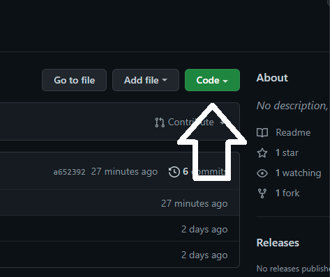

Copie o link e crie uma pasta, dentro da basta clique com o botão direito e procure pelo comando "Git BASH".

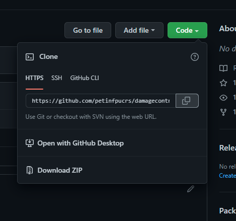
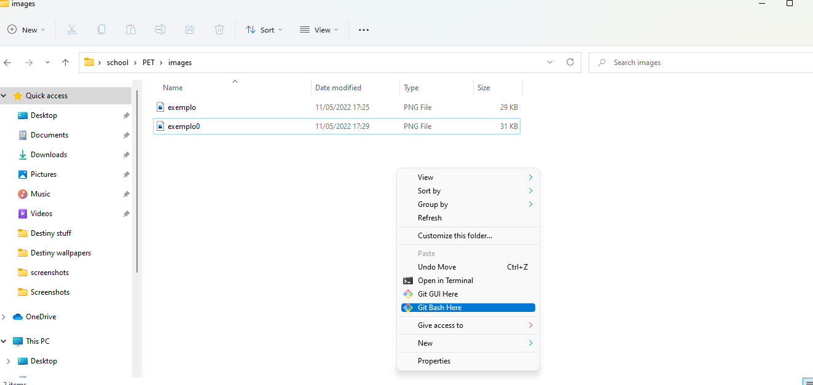

Dentro do "Git BASH" digite o comando "git clone (link do repositório)" e clique enter.

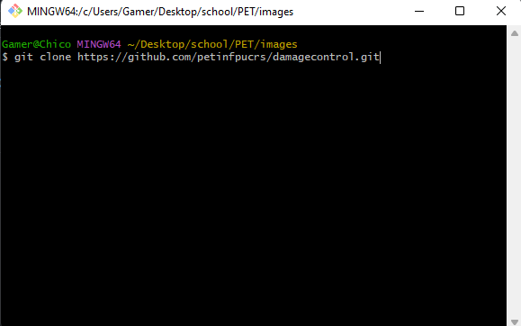

Com a pasta com os arquivos criados, dentro dela abra o "Git BASH" novamente e digite "code ." com isso o VScode irá abrir com o repositório.

Dentro do VScode para logar em sua conta do GitHub, abra o terminal, selecione a opção "BASH" e dentro dele digite esses comandos: 
git config --global user.email "seuemail.com" e git config --global user.name "SeuUsernameDoGitHub".

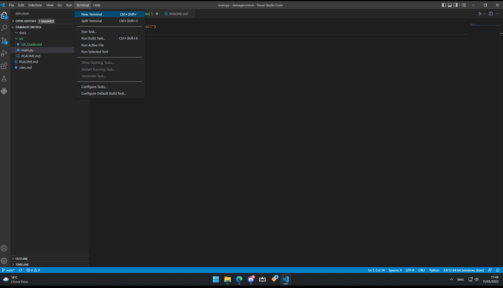
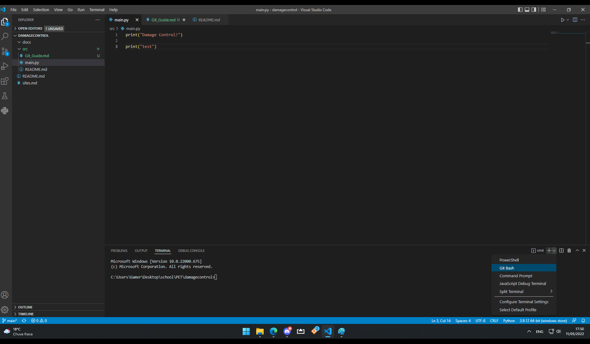

Após cada alteração feita dentro do repositório um icone irá aparecer no quanto esquerdo com um número azul em cima, o nome desta opção é "source control" nela tu aprova as mudaças que serão enviadas ao GitHub. Em cada arquivo que ainda não foi aprovado tem o icone "U" após clicar na opção "+" ele irá mudar para "A", caso tu queira enviar tudo sem ter que clicar individualmente em cada arquivo, em cima dos arquivos ao lado do nome Source Control tem o icone "check" que envia tudo de uma vez, ao clicar nele o vscode vai pedir um comentário antes de enviar, geralmente se escreve as mudanças feitas nos arquivos.

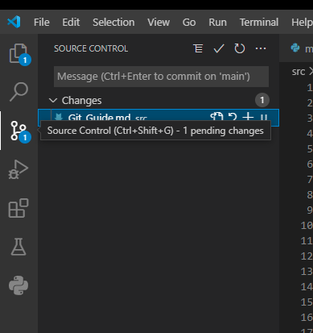
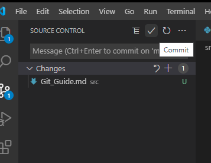

Depois de dar Commit em tudo é para um dos icones da barra em baixo ter mudado, agora a opção "push" irá ter uma seta para baixo com "0" e uma para cima com "1" demonstrando as mudanças que irão ser feitas, assim que clicar no icone o VScode irá mandar as mudanças para o GitHub.

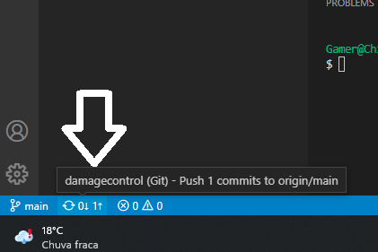

Ao lado do "push" tem o simbolo do source control escrito "main" ao lado, isso demonstra para qual "branch" tu está mandando as suas mudanças, se clicar em cima dele tu pode criar ou escolher outras "branchs" para mandar mudanças, o GitHub costuma fundir as branchs se não ouver conflito entre os códigos.

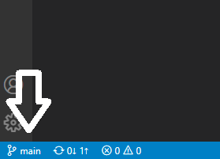
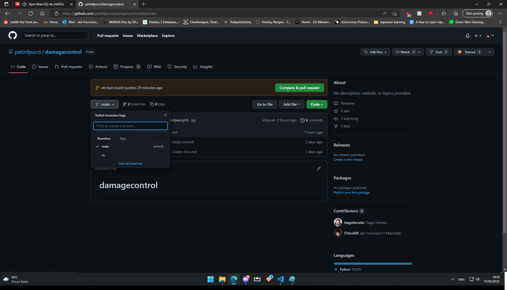
